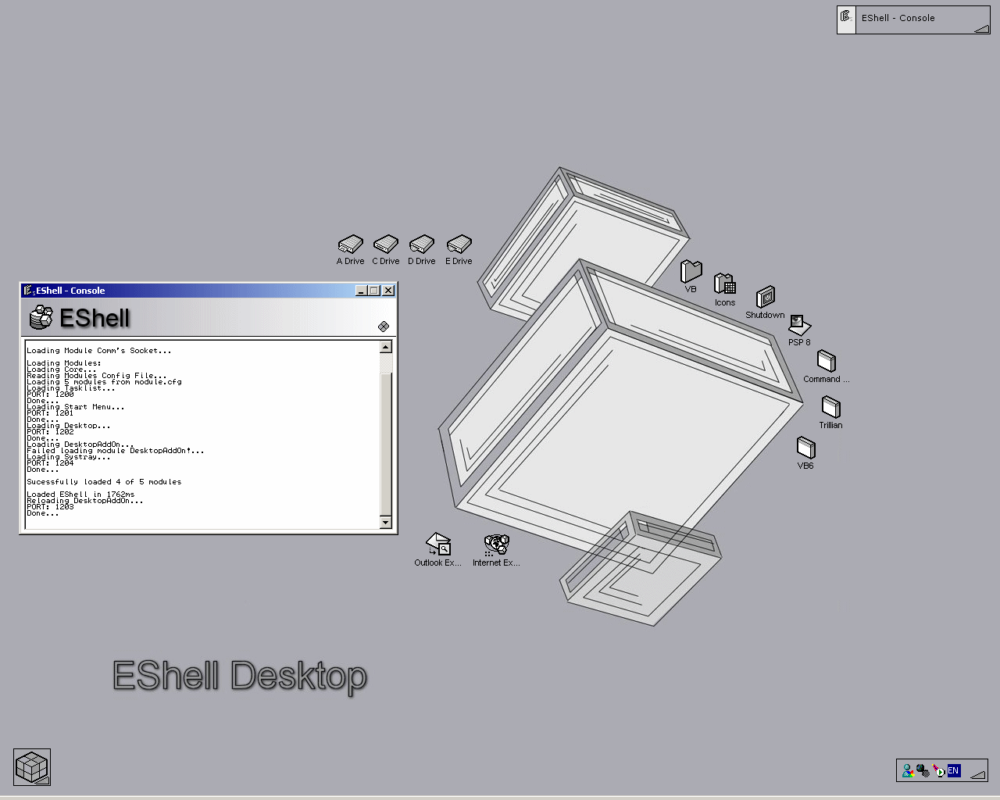

## EShell Beta2 \- Release1

### Description

Well, after alot of hard work, I've got a new version of EShell. There are still a few bugs lurking in it that need to but ironed out but its pretty stable (DesktopAddon module doesnt like loading first time though). This time i've gone for a modularised Shell were each part is in a different EXE. ** IMPORTANT ** : READ THE RELEASE NOTES THAT ARE DISPLAYED WHEN YOU FIRST RUN ESHELL, COMPILE ALL THE EXE'S AS DESCRIBED OR ESHELL _WILL_NOT_ WORK!!!. Still to come: Replace the Explorer style file browser with an EShell module. A logoff button =o/. System monitor module. Module + Core crash detecting Module (what if that one crashes =oP). And some other stuff. Please vote, and leave comments. Thanks, Nick Ridley
 
### More Info
 

             |
---                |---
**Submitted On**   |2003-04-06 21:30:56
**By**             |[Nick Ridley](https://github.com/Planet-Source-Code/PSCIndex/blob/master/ByAuthor/nick-ridley.md)
**Level**          |Advanced
**User Rating**    |4.2 (21 globes from 5 users)
**Compatibility**  |VB 6\.0
**Category**       |[Windows System Services](https://github.com/Planet-Source-Code/PSCIndex/blob/master/ByCategory/windows-system-services__1-35.md)
**World**          |[Visual Basic](https://github.com/Planet-Source-Code/PSCIndex/blob/master/ByWorld/visual-basic.md)
**Archive File**   |[EShell\_Bet157099482003\.zip](https://github.com/Planet-Source-Code/nick-ridley-eshell-beta2-release1__1-44558/archive/master.zip)

